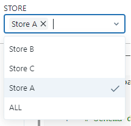
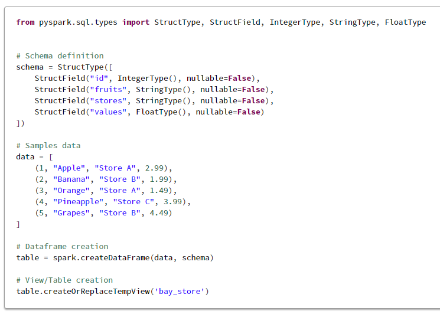
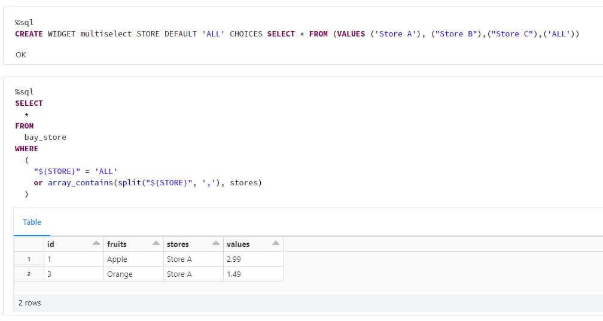
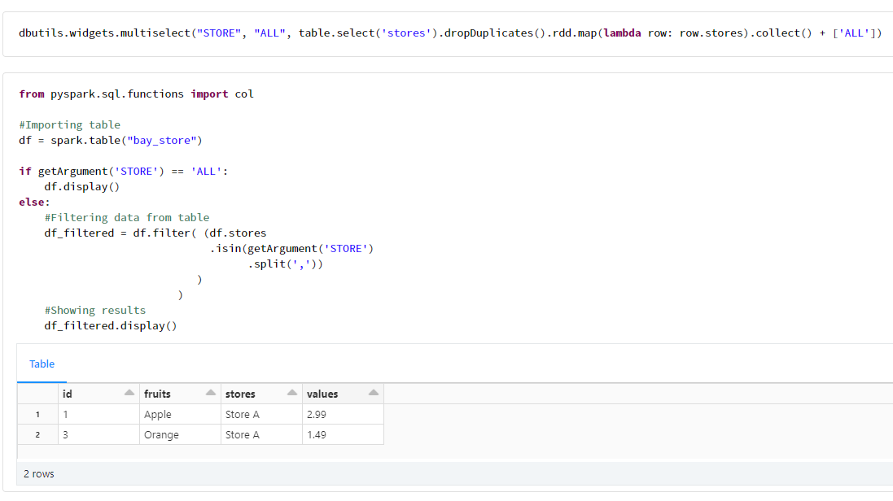

# Multi Select Widget Databricks Solution
This is a solution we found on how to use one or more options in the multiselect widget on Databricks Notebook environment.

The created Widget will look like this:

-----

## Creating Sample Data

-----

## Creating Widget using SQL

-----

## Creating Widget using Python/PySpark

